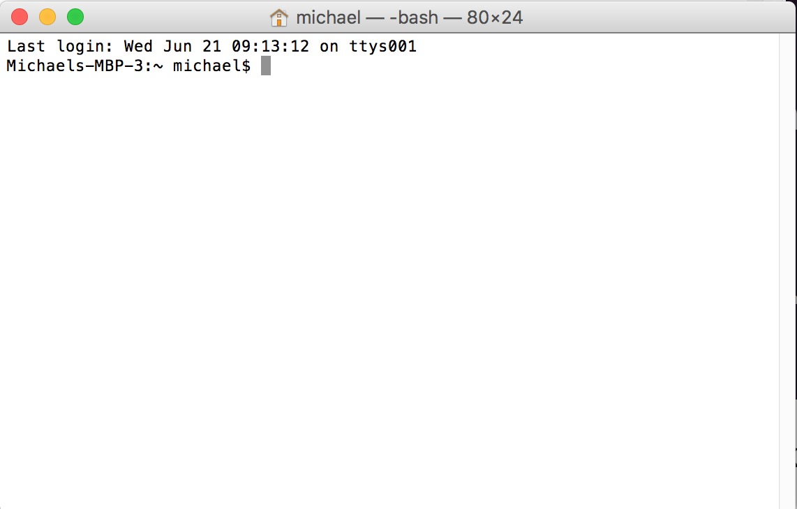

# Programs

Computers are dumb. Sure, they can do some things that we mere humans
can barely understand. For example, they can multiply the numbers
159374930 and 43849593 faster than you can read the answer. They can
perfectly remember the words in millions of books, while we humans can
have trouble memorizing a single page of "Cat in the Hat."

But that doesn't make computers smart. They do exactly what they're
told, and nothing more. If you tell a human "walk to the store and buy
a loaf of bread," the human will figure out that you need to put your
shoes on, grab some money, look both ways before crossing the street,
and actually bring the bread home after you buy it. A computer would
need to be told each and every one of those things.

To make it worse, computers don't speak English. They don't speak
Chinese. They don't speak _any_ human language. They speak something
called machine code, which is just a bunch of ones and zeros (also
known as _binary_). Machine code just does boring things like "add two
numbers together" or "load up some information from your memory." And
we humans don't much like dealing with those boring details, much less
deal with them in ones and zeros. We like to think in words and bigger
concepts.

But you've seen your computer do "smart" things. You're probably
reading this on your computer right now. And you're not reading ones
and zeros, you're reading words on a page. You're able to use your
mouse to scroll up and down. If you get bored reading this (I don't
blame you), you can go play a game or watch a movie. How do computers
do these smart looking things instead of just doing math?

The answer is _programs_.

## What is a program?

Computers only understand machine code. Programs are a bunch of
machine code that tell the computer to do something more intelligent,
usually to make it easier for a human to _interact_ with it. By
interact, I mean communicate with the computer. For example, asking
the computer to add 5 and 7 is difficult with machine code. However, I
bet you can open up a calculator on your computer right now, click on
"5", then "+", then "7", then "=", and get an answer (though I also
hope you can do that math _without_ a computer).

That calculator you opened isn't magic. It's a program. It provides an
_interface_ to humans to be able to tell your computer what to do. In
this case, the interface is a bunch of buttons on the screen you can
click with your mouse. An interface provides a human a way to
communicate with the computer.

I'm guessing you're reading this on a web page right now. You view web
pages in a program called a _web browser_, like Firefox or
Chrome. This is another program that tells the computer what to
do. Behind the scenes, this program is sending messages to computers
all over the world asking for web pages, and then turning those web
pages into text and colors that you can look at, read, and click on.

These programs are _graphical user interfaces_. You (the human) are
the user. The program provides an interface, something for you to
interact with. And it's graphical: with colors, windows, mouse
interactions, and so on.

## Text user interface

Before graphical user interfaces existed, there were _text_ user
interfaces. These allow you to type in commands as words instead of
clicking on things. This still isn't machine code; you're still
interacting with a program, which is translating what you're saying to
the computer. But let's go ahead and do some of this now.

__NOTE__ These instructions are intended for Linux and Mac users. They
probably won't work on Windows.

Your computer has a program called a _terminal_, which will provide a
window to run text-based programs in. Go ahead and open it up (ask
someone for help if you need it). On a Linux machine, you can usually
do this by holding the CTRL and ALT keys on the keyboard and then
pressing the `T` letter (for Terminal). On a Mac, hold "control" and
press the spacebar, type "terminal", and hit "enter". It should look
something like this:

Your terminal is running another program inside of it already, called
a _shell_. The shell speaks its own language which is sort of like
English, but not quite. You communicate with the shell by typing in
commands and hitting enter. This is also known as the shell's
_input_. The shell communicates back with you by putting things on the
screen. This is also known as the shell's _output_. To demonstrate,
try typing in the following and then hit enter:

    echo Hello World

The shell should say "Hello World" back to you (like an echo... get
it?). It will look something like this:

The way the shell works is that the first word you type in is a
_command_, like `echo`, and the rest of the words are _arguments_,
like "Hello" and "World". You've said to the shell "run the command
`echo`, and give it the arguments `Hello` and `World`." The shell
responds to the command `echo` by running a new text-based program
called `echo` with the arguments `Hello` and `World`. And the machine
code in `echo` knows that it should print those words back out.

Want to try another? Try typing the command `date`. It should give you
the current date and time. Wait a few seconds and run it again, and
you should get slightly different output.

You can even download web pages with the terminal. Want to go to
YouTube? Try typing in `curl https://www.youtube.com`. This won't look
like what you're used to seeing, it's just a bunch of weird letters,
numbers, and symbols. That's what the web page looks like inside. Your
web browser has been converting it to something easier for you to
interact with.

__Question__ What program did you run to look at YouTube? What
argument did you give to that program?

So why do we care about these text interfaces when we have such better
graphical interfaces today? Why would you _ever_ run `date` if your
computer just shows you the time already? What possible use does
`echo` have? And why would I download a webpage like that when I could
actually watch a video in my browser?

The answer is that the shell is very powerful, and allows us to do
some things that are difficult or impossible from a graphical
interface. If you only ever use a graphical interface, you're limiting
what you will be able to accomplish. And when it comes to programming,
many things are much easier to do with the text interface.

__Exercise__ Type in `bake a cake`. What happens? Why do you think
that happens?

## Silly calculator

Our shell can do some special _magic_ itself. For example, you can use
it as a little calculator. Try typing in the following:

    echo $((5 + 3))

Tada, you have a text based calculator! It turns out that a shell is
more than I've told you already; it's a complete _programming
language_. A programming language is a language that allows you to
write your own programs. What's cool about the shell is you can write
some really simple programs right in the terminal, like our mini
calculator.

There are lots of different programming languages out there. You may
have heard of some of them: Javascript, C++, Python, and Ruby. You may
be wondering why there are so many different programming languages
instead of just one. Let me ask _you_ a question: why are there so
many different human languages, like English, French, Spanish,
Japanese, and Russian? It turns out there are lots of reasons for
this. Each programming language does things a little bit differently.

In this magical guide, we'll be talking about a programming language
called Haskell. Since this will be the first programming language you
learn, I'm not going to tell you what makes it different than other
languages, because that would just be confusing. Treat it as another
piece of magic for now. After you've learned Haskell, you can learn
other languages and see how they're different, just like how once you
know English, you can learn Hebrew and see how different it is (weird!
the letters go right to left instead of left to right!).

With shell, I said you could write some simple programs right in the
terminal. But if we want to write real programs, we probably don't
want to have to type the whole program in on a terminal each time we
want to use them. So instead, we usually write programs into
files. Which brings us to our next section...

## Files and directories

Your computer has to remember a lot of things. All of those programs
that it runs need to get put somewhere, right? And let's say you're
working on a school project and hit the "save" button, it gets put
somewhere, right? The answer to all of this is called _files_ and
_directories_. Directories are also known as _folders_.

A file is something that has a name and has some stuff inside of
it. Files get placed inside directories, which are kind of like trees
where you can organized things. We can explore this a little bit
inside the shell. For example, type in `pwd` and hit enter. `pwd`
stands for "print working directory," and it tells you what directory
your shell is working in right now. On my computer, I see:

    Michaels-MBP-3:~ michael$ pwd
    /Users/michael

The forward slashes (`/`) are separators: they tell you where each
directory name stops and the next one begins. What this means is
"There's a directory at the top of my computer called `Users`. Inside
that directory is another directory called `michael`. That's the
directory I'm inside right now."

We can also look at what files and folders exist in the current
directory by using the `ls` command (list). For example, this is what
my directory looks like:

    Michaels-MBP-3:~ michael$ ls
    Applications  Desktop    Downloads  Library  Music     Public
    Audiobooks    Documents  Health     Movies   Pictures  dotfiles

Usually when you do this in your terminal, directories will be a dark
blue so you can tell them apart. You can move around to other
directories with the command `cd` (change directory). For example, I
can change into the `Documents` directory with:

    cd Documents

__Cool trick__ Programmers are really lazy, and we hate typing in
whole words. In the shell, you can usually do something called _tab
completion_, where you type the beginning of a word and then hit the
"tab" key to complete it. On my computer, I can do `cd Doc` and then
hit "tab" to get the command above.

Take a guess what `pwd` will say now that I'm inside the `Documents`
directory. Have you guessed? here's what it looks like:

    Michaels-MBP-3:Documents michael$ pwd
    /Users/michael/Documents

It's just like `/Users/michael` before, but now it also has
`Documents` at the end. We've gone deeper in our directory tree. I can
also use `ls` here:

    Michaels-MBP-3:Documents michael$ ls
    magical-guide-haskell

Huh, look at that! I'm working on this guide right now!

Let's say I'm bored with documents, and I want to go back up the tree
to `/Users/michael`. I _could_ type in `cd /Users/michael`. But
there's a nice shortcut for this: `cd ..` means "go up one directory."

    Michaels-MBP-3:Documents michael$ cd ..
    Michaels-MBP-3:~ michael$ pwd
    /Users/michael
    Michaels-MBP-3:~ michael$ ls
    Applications  Desktop    Downloads  Library  Music     Public
    Audiobooks    Documents  Health     Movies   Pictures  dotfiles

Let's see how to create our own directory, which we'll be doing some
work in. So that it's a bit easier to see, we're going to do this on
the desktop, so first I'll do `cd Desktop`, and then use the `mkdir`
command (make directory):

    Michaels-MBP-3:~ michael$ cd Desktop/
    Michaels-MBP-3:Desktop michael$ mkdir magic
    Michaels-MBP-3:Desktop michael$ ls
    magic
    Michaels-MBP-3:Desktop michael$ cd magic

Let's see if you can do this as well. Then, try to find the directory
you just created using your file viewer in the graphical user
interface again. (Ask for help if you need it.)

OK, now we're finally going to create a file. First, let's create an
empty file using the `touch` command. Make sure you're inside the
`magic` directory you just created (use `pwd` to check, and `cd` to
change if you need to). Then run:

    Michaels-MBP-3:magic michael$ touch hello.txt
    Michaels-MBP-3:magic michael$ ls
    hello.txt

I put the `.txt` at the end as a _file extension_ that helps us know
that this is a plain text file. But that file is kind of boring, it
would be cool if it had something in it. We can do that with `echo`:

    Michaels-MBP-3:magic michael$ echo Hello World > hello.txt

The `>` here says "send the output from this program to this file."
But how do we know it worked? Well, try two different things:

1.  In your graphical interface, find the `hello.txt` file and
    double-click it.

2.  You can use the `cat` command from your shell also:

        Michaels-MBP-3:magic michael$ cat hello.txt
        Hello World

Yay, you've created a file!

## Text editor

It would be pretty irritating to have to create all of our programs
using `echo` like that. When we edit files, we usually use a program
that's specially designed for that. And for creating text files (like
our programs are going to be), we use a _text editor_. Like
programming languages, there are lots of different text editors. I'm
going to recommend that you use a graphical text editor so you can use
your mouse to move around the file and click on a button to
save. There are also text-based editors (like Vim and Emacs), but we
want to focus here on learning to program, not on how to use a text
editor.

__Exercise__ Alright, here's your challenge: Open up a text editor on
your computer. Type in the words `echo Hello World`. Now save it
inside the `magic` directory you created in a file called `hello.sh`
(the `.sh` file extension means "shell program"). Once you've done
that, the file should appear in your file viewer, and typing `ls` in
your terminal should show it. Finally, type `sh hello.sh` to ask the
`sh` (shell) program to run your `hello.sh` program.

If you've done all that, you've written your first, complete
program. It doesn't do much, but it's something! Also, do you think
it's a little bit funny how you run the program? You ask one program
to run another program. This kind of makes sense, if you remember what
I said before: you're righting in a programming language (shell) that
the computer doesn't understand, so you need to ask a _different_
programming language to translate.

This way of running is called an _interpreter_, because you're running
a program that interprets your commands and sends them to the
computer. There's another way of running, called _compiling_, where
you ask a program called a compiler to translate your programming
language into machine code. You then end up with a file in machine
code that you can ask your computer to run directly.

Don't worry about this too much yet, treat it as a bit of magic, and
eventually we'll get to why you would do one or the other.

## Download Stack

OK, that was a lot of information that had very little to do with
programming! The goal here is that you're now comfortable with the
terminal, the shell, and creating files and folders. Go ahead and play
around with the terminal as much as you want. (__Parent notice__ It's
probably a good idea to put your kids on their own accounts so they
don't accidentally delete your files.)

For our final step today, we're going to actually get the programs you
need in order to write Haskell programs. There are a number of
different programs you'll end up needing. We'll start right now with
just one, Stack, which is a tool that will download everything else
you need, and help you run your programs.

You can install Stack by running this command. You can try
copy-pasting into your terminal, or type it by hand. You may also need
to ask your parent to type in the password for the computer:

    curl -sSL https://get.haskellstack.org/ | sh

Oh, and if your parent is like me (or is me), you may already have Stack on the
computer. If you want more information on getting Stack, check out the [Haskell
Get Started page](https://haskell-lang.org/get-started). To make sure that
Stack downloaded correctly, try running this:

    Michaels-MBP-3:~ michael$ stack --version
    Version 1.4.1, Git revision 45e2ba52a08b235ef1a6421e73bbbe7255014796 (4759 commits) x86_64 hpack-0.17.0

You may see something a little bit different. The `--version` thing is
a special argument to `stack` that means "tell me what your version
number is." Many programs accept a few special _flags_ like
`--version`. Another common one is `--help`. Try asking Stack for its
help information that way.

Stack still needs to download something called GHC (the Glasgow
Haskell Compiler), which will do all of the real work. You can tell it
to do that now (it will probably take a while, so this is a good place
to stop the lesson). Run:

    Michaels-MBP-3:~ michael$ stack setup --resolver lts-8.12

The `setup` argument is a command to Stack saying "set up all of the
stuff I need to get to work." You'll see the `--resolver lts-8.12`
quite a bit. For now, it's magic. :)

Good work today, you now know a lot more about how computers work than
most adults in the world.
